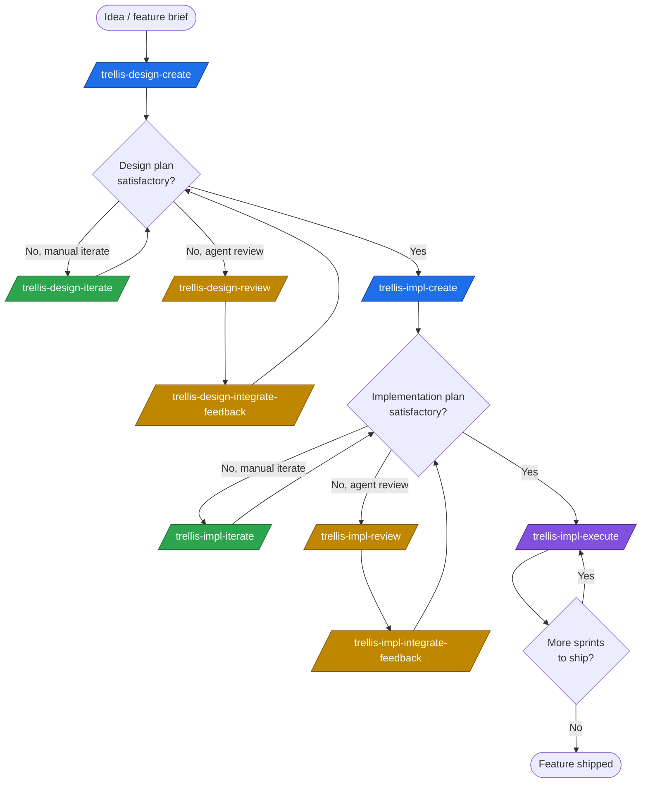

# Trellis

A set of manually-invoked Claude Code / Codex skills for taking an engineering feature from "rough idea" to "merged code, one reviewable commit per step."

Trellis splits the work into three layers, each with its own discipline:

1. **Design plan** — _what_ the system is. Decisions, rationale, scope, open questions.
2. **Implementation plan** — _how_ and _in what order_ it gets built. A directory of sprint files with a master progress checklist.
3. **Execution** — actually shipping the code, one step at a time, with a per-step subagent that implements, gets reviewed, and commits.

Each layer has a `create` skill (bootstrap), an `iterate` skill (drive forward another round), and a `review` + `integrate-feedback` pair (agent-based external critique that gets triaged back into the plan). The execute skill is the terminal — it dispatches sprint steps one at a time.

---

## Why Trellis exists

LLM coding agents have a few well-known failure modes when given an open-ended feature task:

- **They fabricate decisions** instead of surfacing the choice to the user.
- **They leave stale wording in place** when a later round changes direction, so the doc contradicts itself.
- **They skip the "why"** behind shape decisions, so the next reader (or the next round) has nothing to argue against.
- **They balloon a single PR** with sprawling unreviewable changes that mix architecture, infra, and feature work.
- **They drift** across long conversations, silently re-deciding things they decided three rounds ago.

Trellis is the set of guardrails that has worked for me against those failure modes. Concretely:

- Every skill is **manually invoked** (`disable-model-invocation: true`) — the model never decides to start a planning round on its own.
- Every round produces an explicit **completeness assessment** with a verdict (`not-yet-complete` / `substantially-complete` / `complete`), so drift surfaces early.
- Open questions carry **severity tags** (`[blocks-v1]` / `[blocks-impl]` / `[deferred]` / `[exploratory]`) so the user can grep for what's load-bearing.
- The decisions log and the body **must agree** — supersession discipline forces stale wording to be purged, not left in place.
- Reviews are a separate file; **integration triages** them into five buckets (incorporate, minor incorporate, open question, **reviewer-wrong**, ignore) so confident-but-wrong reviewer findings don't corrupt the plan.
- Execution **dispatches per-step subagents** so the main chat stays small. Each step is its own commit, reviewed by another subagent, with a durable execution record under `reviews/`.

The design plan, implementation plan, and execution layers are deliberately separated: _what the system is_ shouldn't be litigated while writing sprint steps, and _how it gets built_ shouldn't be litigated while writing code.

---

## Who Trellis is for

- Engineers using Claude Code or Codex on feature work that's **bigger than a one-shot edit** — anything where upfront design, sprint-style sequencing, and reviewable per-step commits would be valuable.
- Teams that want a **durable audit trail** of why each decision was made and which round made it.
- People who've been bitten by agents that hallucinate decisions, drop scope silently, or land 4,000-line PRs that nobody can review.

Trellis is **architecture-agnostic**: it works for backend services, frontend apps, CLIs, mobile clients, libraries, infrastructure modules, and data pipelines. The structural mechanics (rounds, decisions logs, sprint roster, dependency graph, per-step commits) hold in every case; the _content_ of those structures is inherited from the project's own conventions (`CLAUDE.md` / `AGENTS.md` / equivalent).

---

## When to use Trellis (vs. other tools)

**Reach for Trellis when:**

- The work is large enough that a one-shot agent run would lose coherence (multi-week feature, multi-sprint rollout, cross-service contract change, schema-touching refactor).
- You want every load-bearing shape decision **surfaced before code is written**.
- You want **per-step commits with reviews** instead of one giant merge.
- You want a **plan that survives the conversation** — readable cold by another engineer (or another agent) a week later.
- You're collaborating with an agent that you don't trust to make judgment calls on your behalf.

**Reach for something else when:**

- The task is a single-file change, a quick bug fix, or a small refactor — Trellis would be overkill.
- You're prototyping / exploring and don't want a paper trail.
- You already have a finished design and just need an agent to bang out the code — skip straight to whatever step-execution loop you prefer; Trellis's planning skills would just be friction.
- The task fits inside a single Claude Code planning step (`ExitPlanMode`) — the built-in plan mode is lighter weight.

Trellis sits **above** "agent-writes-some-code" and **below** "engineering-team-with-Linear-and-Figma." It's the layer that turns an idea into a sequenced, reviewable build.

---

## The flow



### How to use it (step by step)

1. **Start a design plan.** Invoke `trellis-design-create <output-path>` with a briefing of the feature. Round 1 lands the foundational decisions, scope, cross-references, and an open-questions list — _not_ the schema or API surface.

2. **Iterate the design plan.** Either:
   - Drive it manually with `trellis-design-iterate <plan-path>`. Each invocation runs one round (1–5 open questions resolved, decisions logged, status updated, completeness assessment emitted).
   - Get an external agent read with `trellis-design-review <plan-path> <review-output-path>`, then triage the review back into the plan with `trellis-design-integrate-feedback <plan-path> <review-path>`.
   - You can keep iterating in the same chat session **without re-invoking the skill each turn** — the skill establishes the round discipline, then the conversation continues under it.

3. **Once the design plan is `complete`** (zero `[blocks-v1]` / `[blocks-impl]` open questions remaining, doc internally clean), graduate to implementation planning.

4. **Bootstrap the implementation plan.** Invoke `trellis-impl-create <design-plan-path> <impl-plan-dir>`. Round 1 produces a directory: `overview.md` (philosophy, sprint roster, dependency graph, feature-wide locked decisions — no Decisions log or Status section), `decisions.md` (plan-level Decisions log — its own top-level file), `status.md` (plan-level round-by-round audit trail — its own top-level file), `progress.md` (master checklist), and one stub file per sprint (`01-<topic>.md`, `02-<topic>.md`, …).

5. **Iterate the implementation plan.** Same shape as design:
   - `trellis-impl-iterate <impl-plan-dir>` to drive the next round (typically: lock one stub sprint to execution-ready, or resolve a handful of open questions, or re-slice the roster).
   - `trellis-impl-review <impl-plan-dir> <review-output-path>` then `trellis-impl-integrate-feedback <impl-plan-dir> <review-path>` for an external read.
   - Same conversational continuation — keep talking after the skill completes; you don't need to re-invoke each turn.

6. **Execute sprints, one step at a time.** Once a sprint is execution-ready (Locked Decisions table populated, Implementation Steps with concrete Verification, Step Dependency Chart, Acceptance checklist), invoke `trellis-impl-execute <sprint-file> <from-step> [<to-step>]`. The orchestrator dispatches a per-step subagent that implements, runs verification, gets reviewed by another subagent, addresses the review, commits, and updates Progress. The orchestrator validates the hand-back (clean tree, new commit, Progress checked) and moves to the next step.

### Each command can take inline instructions

Every skill accepts free-text instructions alongside the invocation — they take precedence over the skill's defaults for that run. Examples: _"Focus only on the schema questions this round"_, _"This is a CLI project, ignore the backend examples in the brief"_, _"Don't ask me to confirm framing in Step B, just draft it"_.

You can also persist instructions across runs via:

- `~/.trellis/instructions.md` — applies to every Trellis invocation, every project.
- `<repo-root>/.trellis/instructions.md` — applies to every Trellis invocation in the current repo.
- Inline instructions — apply to the current run only, highest precedence.

---

## The skills

| Skill                               | Purpose                                                 | Args                                    |
| ----------------------------------- | ------------------------------------------------------- | --------------------------------------- |
| `trellis-design-create`             | Bootstrap a design plan (Round 1)                       | `<output-path>`                         |
| `trellis-design-iterate`            | Drive a design plan one round forward                   | `<plan-path>`                           |
| `trellis-design-review`             | Agent-based review of a design plan                     | `<plan-path> <review-output-path>`      |
| `trellis-design-integrate-feedback` | Triage a review back into the design plan               | `<plan-path> <review-path>`             |
| `trellis-impl-create`               | Bootstrap an implementation plan (Round 1)              | `<design-plan-path> <impl-plan-dir>`    |
| `trellis-impl-iterate`              | Drive an implementation plan one round forward          | `<impl-plan-dir>`                       |
| `trellis-impl-review`               | Agent-based review of an implementation plan            | `<impl-plan-dir> <review-output-path>`  |
| `trellis-impl-integrate-feedback`   | Triage a review back into the implementation plan       | `<impl-plan-dir> <review-path>`         |
| `trellis-impl-execute`              | Execute a range of sprint steps with per-step subagents | `<sprint-path> <from-step> [<to-step>]` |

All skills are manually invoked (`disable-model-invocation: true`) — the model never starts a Trellis round on its own.

---

## Repository layout

```
trellis-design-create/         design plan bootstrap + authoring guide
trellis-design-iterate/        design plan round-by-round driver
trellis-design-review/         design plan reviewer brief
trellis-design-integrate-feedback/  triage review into design plan

trellis-impl-create/           impl plan bootstrap + authoring guide
trellis-impl-iterate/          impl plan round-by-round driver
trellis-impl-review/           impl plan reviewer brief
trellis-impl-integrate-feedback/    triage review into impl plan

trellis-impl-execute/          orchestrator + per-step executor + per-step reviewer
```

The two authoring guides — `trellis-design-create/design-plan.md` and `trellis-impl-create/implementation-plan.md` — are the load-bearing references. Every other skill links back to them.
