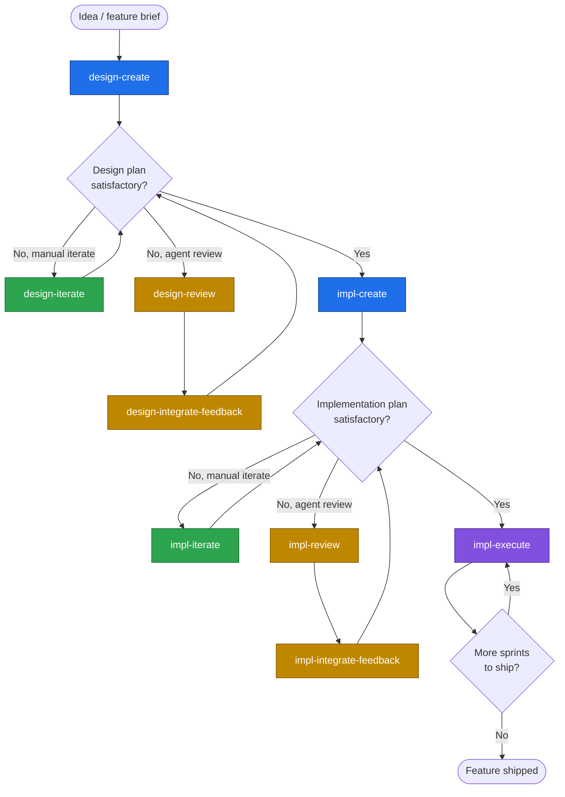

# Trellis

A single, manually-invoked Claude Code / Codex skill for taking an engineering feature from "rough idea" to "merged code, one reviewable commit per step."

Trellis splits the work into three layers, each with its own discipline:

1. **Design plan** — _what_ the system is. Decisions, rationale, scope, open questions. Lives at the canonical path `<root>/design.md` inside a user-chosen feature root directory.
2. **Implementation plan** — _how_ and _in what order_ it gets built. A set of files directly in the feature root, with sprint files and a master progress checklist. Lives directly in `<root>` alongside `design.md`.
3. **Execution** — actually shipping the code, one step at a time, with a per-step subagent that implements, gets reviewed, and commits.

Each layer has a `create` operation (bootstrap), an `iterate` operation (drive forward another round), and a `review` + `integrate-feedback` pair (agent-based external critique that gets triaged back into the plan). The execute operation is the terminal — it dispatches sprint steps one at a time. All nine operations live inside one `trellis` skill; the agent picks the right one from the user's natural-language invocation.

---

## Why Trellis exists

LLM coding agents have a few well-known failure modes when given an open-ended feature task:

- **They fabricate decisions** instead of surfacing the choice to the user.
- **They leave stale wording in place** when a later round changes direction, so the doc contradicts itself.
- **They skip the "why"** behind shape decisions, so the next reader (or the next round) has nothing to argue against.
- **They balloon a single PR** with sprawling unreviewable changes that mix architecture, infra, and feature work.
- **They drift** across long conversations, silently re-deciding things they decided three rounds ago.

Trellis is the set of guardrails that has worked for me against those failure modes. Concretely:

- The skill is **manually invoked** (`disable-model-invocation: true`) — the model never decides to start a planning round on its own.
- Every round produces an explicit **completeness assessment** with a verdict (`not-yet-complete` / `substantially-complete` / `complete`), so drift surfaces early.
- Open questions carry **severity tags** (`[blocks-v1]` / `[blocks-impl]` / `[deferred]` / `[exploratory]`) so the user can grep for what's load-bearing.
- The decisions log and the body **must agree** — supersession discipline forces stale wording to be purged, not left in place.
- Reviews are a separate file; **integration triages** them into five buckets (incorporate, minor incorporate, open question, **reviewer-wrong**, ignore) so confident-but-wrong reviewer findings don't corrupt the plan.
- Execution **dispatches per-step subagents** so the main chat stays small. Each step is its own commit, reviewed by another subagent, with a durable execution record under `reviews/`.

The design plan, implementation plan, and execution layers are deliberately separated: _what the system is_ shouldn't be litigated while writing sprint steps, and _how it gets built_ shouldn't be litigated while writing code.

---

## Who Trellis is for

- Engineers using Claude Code or Codex on feature work that's **bigger than a one-shot edit** — anything where upfront design, sprint-style sequencing, and reviewable per-step commits would be valuable.
- Teams that want a **durable audit trail** of why each decision was made and which round made it.
- People who've been bitten by agents that hallucinate decisions, drop scope silently, or land 4,000-line PRs that nobody can review.

Trellis is **architecture-agnostic**: it works for backend services, frontend apps, CLIs, mobile clients, libraries, infrastructure modules, and data pipelines. The structural mechanics (rounds, decisions logs, sprint roster, dependency graph, per-step commits) hold in every case; the _content_ of those structures is inherited from the project's own conventions (`CLAUDE.md` / `AGENTS.md` / equivalent).

---

## When to use Trellis (vs. other tools)

**Reach for Trellis when:**

- The work is large enough that a one-shot agent run would lose coherence (multi-week feature, multi-sprint rollout, cross-service contract change, schema-touching refactor).
- You want every load-bearing shape decision **surfaced before code is written**.
- You want **per-step commits with reviews** instead of one giant merge.
- You want a **plan that survives the conversation** — readable cold by another engineer (or another agent) a week later.
- You're collaborating with an agent that you don't trust to make judgment calls on your behalf.

**Reach for something else when:**

- The task is a single-file change, a quick bug fix, or a small refactor — Trellis would be overkill.
- You're prototyping / exploring and don't want a paper trail.
- You already have a finished design and just need an agent to bang out the code — skip straight to whatever step-execution loop you prefer; Trellis's planning operations would just be friction.
- The task fits inside a single Claude Code planning step (`ExitPlanMode`) — the built-in plan mode is lighter weight.

Trellis sits **above** "agent-writes-some-code" and **below** "engineering-team-with-Linear-and-Figma." It's the layer that turns an idea into a sequenced, reviewable build.

---

## The flow



### How to use it (step by step)

Invoke the `trellis` skill in natural language. The skill reads your request, infers which of the nine operations you want, extracts the paths you provided, and loads only the instruction file and spec the operation needs. There are no positional arguments.

**Path conventions.** Both planning artifacts live inside a single user-chosen feature root `<root>`:

- The **design plan** is always at `<root>/design.md`. The user names only the root; the agent appends `design.md`. If the user types a full path ending in `design.md`, the agent treats its parent as the root.
- The **implementation plan files** live directly in `<root>` alongside `design.md`. The user names the feature root for implementation operations.

A typical feature layout:

```
<root>/
├── design.md
├── overview.md
├── decisions.md
├── status.md
├── progress.md
└── 01-<topic>.md … NN-<topic>.md
```

1. **Start a design plan.** Name the feature root — e.g., _"Use trellis to start a new design plan at `docs/features/refunds/`. Here's the feature brief…"_. The agent creates `docs/features/refunds/design.md`. Round 1 lands the foundational decisions, scope, cross-references, and an open-questions list — _not_ the schema or API surface.

2. **Iterate the design plan.** Either:
   - Drive it manually — _"Use trellis to iterate the design plan at `docs/features/refunds/`; focus on Q3 and Q7 this round."_ Each round resolves 1–5 open questions, logs decisions, updates status, and emits a completeness assessment.
   - Get an external agent read — _"Use trellis to review the design plan at `docs/features/refunds/` and save the review to `docs/features/refunds/review-r4.md`."_ Then triage the review back in — _"Use trellis to integrate `docs/features/refunds/review-r4.md` into the design plan at `docs/features/refunds/`."_
   - You can keep iterating in the same chat session **without re-invoking the skill each turn** — once a round establishes the discipline, the conversation continues under it.

3. **Once the design plan is `complete`** (zero `[blocks-v1]` / `[blocks-impl]` open questions remaining, doc internally clean), graduate to implementation planning.

4. **Bootstrap the implementation plan.** _"Use trellis to bootstrap an implementation plan at `docs/features/refunds/`."_ The agent consumes `docs/features/refunds/design.md` and creates `overview.md` (philosophy, sprint roster, dependency graph, feature-wide locked decisions — no Decisions log or Status section), `decisions.md` (plan-level Decisions log), `status.md` (plan-level round-by-round audit trail), `progress.md` (master checklist), and one stub file per sprint (`01-<topic>.md`, `02-<topic>.md`, …) directly in `docs/features/refunds/`.

5. **Iterate the implementation plan.** Same shape as design:
   - _"Use trellis to iterate the implementation plan at `docs/features/refunds/`; lock Sprint 02 to execution-ready."_ The agent operates on the implementation files in `docs/features/refunds/`. Each round typically locks one stub sprint, resolves a handful of open questions, or re-slices the roster.
   - _"Use trellis to review the implementation plan at `docs/features/refunds/` and save to `docs/features/refunds/impl-review-r5.md`."_ Then incorporate that review back in.
   - Same conversational continuation — keep talking after a round completes; you don't need to re-invoke each turn.

6. **Execute sprints, one step at a time.** Once a sprint is execution-ready (Locked Decisions table populated, Implementation Steps with concrete Verification, Step Dependency Chart, Acceptance checklist), _"Use trellis to execute Sprint 02 step 3 through 5 in `docs/features/refunds/02-manager-core.md`."_ The orchestrator dispatches a per-step subagent that implements, runs verification, gets reviewed by another subagent, addresses the review, commits, and updates Progress. The orchestrator validates the hand-back (clean tree, new commit, Progress checked) and moves to the next step.

### Each invocation can take inline instructions

The skill accepts free-text instructions alongside the invocation — they take precedence over the instruction file's defaults for that run. Examples: _"Focus only on the schema questions this round"_, _"This is a CLI project, ignore the backend examples in the brief"_, _"Don't ask me to confirm framing in Step B, just draft it"_.

You can also persist instructions across runs via:

- `~/.trellis/instructions.md` — applies to every Trellis invocation, every project.
- `<repo-root>/.trellis/instructions.md` — applies to every Trellis invocation in the current repo.
- Inline instructions — apply to the current run only, highest precedence.

---

## The operations

All nine operations live inside the single `trellis` skill. The skill's top-level `SKILL.md` maps the user's natural-language request to the right instruction file under `trellis/instructions/`.

| Operation                   | Purpose                                                 | Paths the skill extracts                                              |
| --------------------------- | ------------------------------------------------------- | --------------------------------------------------------------------- |
| `design-create`             | Bootstrap a design plan (Round 1)                       | `<root>`                                                              |
| `design-iterate`            | Drive a design plan one round forward                   | `<root>`                                                              |
| `design-review`             | Agent-based review of a design plan                     | `<root>`, `<review-output-path>`                                      |
| `design-integrate-feedback` | Triage a review back into the design plan               | `<root>`, `<feedback-path>`                                           |
| `impl-create`               | Bootstrap an implementation plan (Round 1)              | `<root>`                                                              |
| `impl-iterate`              | Drive an implementation plan one round forward          | `<root>`                                                              |
| `impl-review`               | Agent-based review of an implementation plan            | `<root>`, plus `<review-output-path>`                                 |
| `impl-integrate-feedback`   | Triage a review back into the implementation plan       | `<root>`, plus `<feedback-path>`                                      |
| `impl-execute`              | Execute a range of sprint steps with per-step subagents | `<sprint-path>`, `<from-step>`, `<to-step>` (optional)                |

For every operation: the design plan is at `<root>/design.md`, and the implementation plan files also live in `<root>`. If the user names `design.md`, `overview.md`, `progress.md`, `decisions.md`, `status.md`, or a sprint file, the agent treats that file's parent as `<root>`.

The skill is manually invoked (`disable-model-invocation: true`) — the model never starts a Trellis round on its own.

---

## Repository layout

```
trellis/
├── SKILL.md                    top-level skill — workflow overview + dispatch
├── specs/
│   ├── design-plan.md          design plan authoring guide
│   └── implementation-plan.md  implementation plan authoring guide
├── subagents/
│   ├── step-executor.md        per-step executor subagent brief
│   └── step-reviewer.md        per-step reviewer subagent brief
└── instructions/
    ├── design-create.md
    ├── design-iterate.md
    ├── design-review.md
    ├── design-integrate-feedback.md
    ├── impl-create.md
    ├── impl-iterate.md
    ├── impl-review.md
    ├── impl-integrate-feedback.md
    └── impl-execute.md
```

The two authoring guides — `trellis/specs/design-plan.md` and `trellis/specs/implementation-plan.md` — are the load-bearing references. Every instruction file under `trellis/instructions/` links back to them. The top-level `trellis/SKILL.md` encourages **lazy loading**: the agent reads only the instruction file the user's request maps to, and only loads the matching spec (`design-plan.md` for design work, `implementation-plan.md` for implementation work) when the operation actually needs it.
